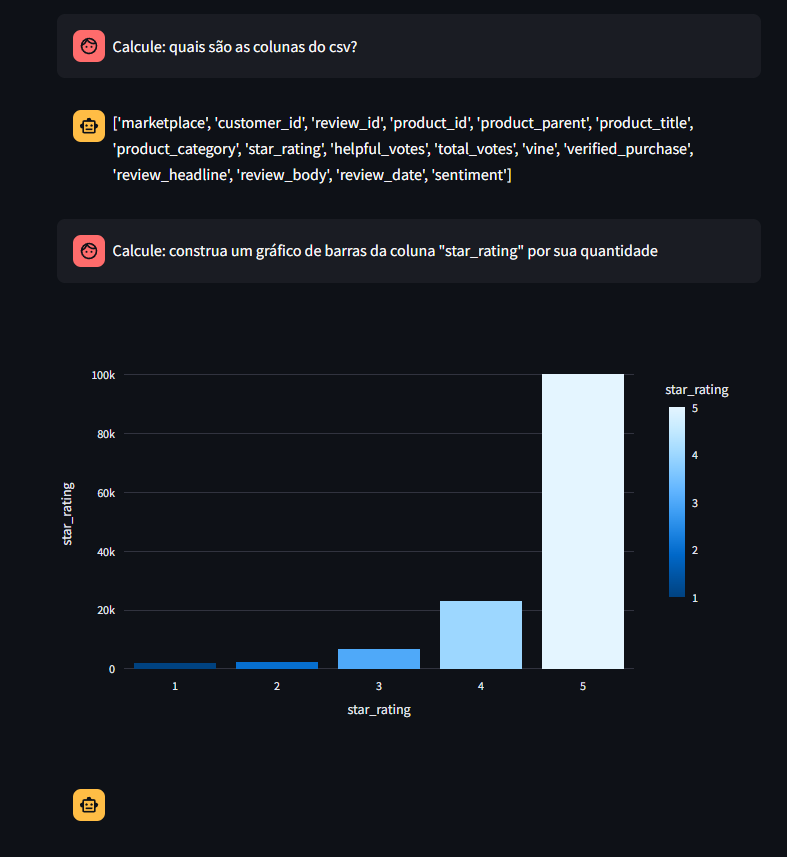
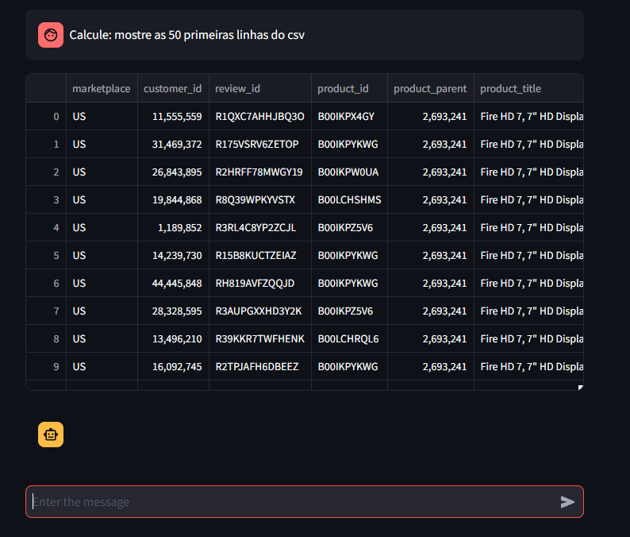

# Assistente para analisar planilhas

Este é um código que utiliza o modelo da Google, o Gemini, para realizar análises em planilhas, criar gráficos e apresentar os dados.

O código já está rodando no streamlit caso queira testar: 
[link do assistente](https://csv-analyzer-yasmim.streamlit.app/)

## Exemplos
Aqui estão alguns exemplos de saída do assistente:






## Instalação

Para instalar as dependências, execute o seguinte comando no terminal:


```bash
pip install -r requirements.txt
```

## Utilização
Para utilizar localmente, siga estas etapas:

1. Adicione um arquivo .env no diretório raiz do projeto.
2. Insira sua chave da API do Google no arquivo .env.
3. Substitua a parte do código:

```bash
GOOGLE_API_KEY = st.secrets["GOOGLE_API_KEY"]
```

Por:

```bash
from dotenv import load_dotenv
import os

load_dotenv()

GOOGLE_API_KEY = os.getenv("GOOGLE_API_KEY")
genai.configure(api_key=GOOGLE_API_KEY)
```

## Contribuição

Se você tem sugestões de melhorias, está mais que convidado(a) a enviar pull requests ou a entrar em contato para discutir ideias. Sua contribuição é muito bem-vinda!

## Conecte-se comigo:

- [Portfólio](https://yasmim-portifolio.vercel.app)
- [Linkedin](https://www.linkedin.com/in/yasmim-abrahao-311491227/)